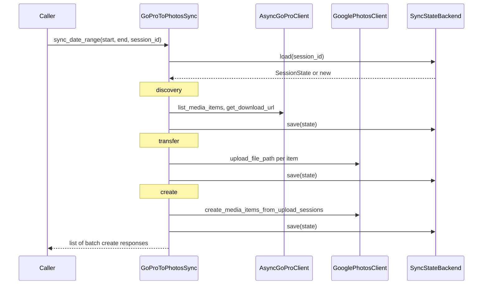

# q2google

[](https://github.com/himewel/q2google/actions/workflows/ci.yml)
[](https://github.com/himewel/q2google/actions/workflows/release.yml)
[](https://pypi.org/project/q2google/)
[](https://pypi.org/project/q2google/)
[](https://github.com/himewel/q2google/releases/latest)
[](https://himewel.github.io/q2google/)
[](LICENSE)

Sync media from **GoPro cloud** into **Google Photos** for a capture date range with **resumable session state**.

## Requirements

- Python **3.12 or 3.13** (3.14 is excluded until dependent wheels catch up)
- **`GP_ACCESS_TOKEN`** or **`Q2GOOGLE_GOPRO_ACCESS_TOKEN`** — GoPro cloud access token (loaded by `Q2GoogleSettings` and passed to `AsyncGoProClient`)
- Google OAuth **installed app** credentials (`client_secret.json` from Google Cloud Console)
- A writable path for the user token (`token.json` by default)

## Install

```bash
pip install q2google
```

Or with [uv](https://docs.astral.sh/uv/):

```bash
uv add q2google
```

Or with [uv](https://docs.astral.sh/uv/):

```bash
uv add q2google
```

## Library usage

### Minimal example

```python
import asyncio
from datetime import datetime

from gopro_api import AsyncGoProClient

from q2google import (
    GoProToPhotosSync,
    GooglePhotosClient,
    GooglePhotosOAuth,
    JsonFileBackend,
    get_settings,
)
from q2google.gphotos.api import GooglePhotosAPI
from q2google.gphotos.models import PhotosScopes


async def main() -> None:
    oauth = GooglePhotosOAuth(
        client_secrets_file="client_secret.json",
        scopes=[PhotosScopes.READ_AND_APPEND],
        token_file="token.json",
    )

    cfg = get_settings()

    async with (
        AsyncGoProClient(access_token=cfg.gopro_access_token) as gopro,
        GooglePhotosAPI(credentials=oauth) as api,
    ):
        photos = GooglePhotosClient(api=api)
        backend = JsonFileBackend(root_dir=".q2google_sessions")

        syncer = GoProToPhotosSync(
            gopro=gopro,
            photos=photos,
            state_backend=backend,
        )

        responses = await syncer.sync_date_range(
            start_date=datetime(2026, 1, 8),
            end_date=datetime(2026, 1, 9),
            session_id="my-session",
        )
        print(f"Created {len(responses)} batch(es).")


asyncio.run(main())
```

### Resuming a session

Pass the same `session_id` on subsequent runs. `GoProToPhotosSync` loads the persisted `SessionState` and skips already-completed items:

```python
responses = await syncer.sync_date_range(
    start_date=datetime(2026, 1, 8),  # ignored when resuming
    end_date=datetime(2026, 1, 9),    # ignored when resuming
    session_id="my-session",          # same key → resumes from checkpoint
)
```

### Custom state backend

Implement `SyncStateBackend` to persist sessions in any storage layer (database, object store, etc.):

```python
from q2google import SessionState, SyncStateBackend


class RedisBackend:
    def load(self, session_id: str) -> SessionState | None:
        raw = redis_client.get(session_id)
        return SessionState.from_dict(json.loads(raw)) if raw else None

    def save(self, state: SessionState) -> None:
        redis_client.set(state.session_id, json.dumps(state.to_dict()))
```

Pass it directly to `GoProToPhotosSync(state_backend=RedisBackend())`. No other changes required.

### Stage completion hook

`on_stage_complete` is called after each of the three pipeline stages (discovery, transfer, create). Use it to report progress, emit metrics, or trigger side-effects:

```python
from q2google.state.base import SessionState, StageKey
from q2google.photos import MediaItemBatchCreateResponse


async def report(
    stage: StageKey,
    state: SessionState,
    responses: list[MediaItemBatchCreateResponse] | None,
) -> None:
    print(f"[{stage}] items={len(state.items)} stage_states={state.stages}")


responses = await syncer.sync_date_range(
    start_date=datetime(2026, 1, 8),
    end_date=datetime(2026, 1, 9),
    session_id="my-session",
    on_stage_complete=report,
)
```

### Public API

All public symbols are importable directly from `q2google`:

| Symbol | Description |
|--------|-------------|
| `GoProToPhotosSync` | Main orchestrator; runs discovery → transfer → create. |
| `GooglePhotosClient` | Resumable upload facade (`upload_file_path`, `create_media_items`). |
| `GooglePhotosOAuth` | Load, refresh, or obtain Google OAuth credentials. |
| `JsonFileBackend` | File-based `SyncStateBackend`; stores each session as a directory of JSON files (`meta.json`, `items/`, `batches/`). |
| `SessionState` | Full persisted session document (`to_dict` / `from_dict` for custom stores). |
| `SyncStateBackend` | Protocol — implement `load` / `save` to plug in any storage layer. |
| `Q2GoogleSettings` | Pydantic settings; batch sizes, timeouts, and paths with env-var overrides. |
| `get_settings` | Return a singleton `Q2GoogleSettings` from environment / `.env`. |

Lower-level symbols in `q2google.gphotos`:

| Symbol | Description |
|--------|-------------|
| `GooglePhotosAPI` | Thin `aiohttp` wrapper for Library v1 — use as `async with GooglePhotosAPI(...) as api`. |
| `GooglePhotoLibraryPort` | Protocol matching `GooglePhotosAPI`; implement for testing or alternative HTTP clients. |
| `PhotosScopes` | Enum of OAuth scopes (`READ_AND_APPEND`, `READ_ONLY`, `APPEND_ONLY`). |

## CLI

The package ships a CLI for one-off or scripted use:

```bash
q2google sync \
  --start-date 2026-01-08 \
  --end-date 2026-01-09 \
  --credentials client_secret.json \
  --token token.json
```

Useful options:

| Option | Description |
|--------|-------------|
| `--state-dir` | JSON session root (default: `.q2google_sessions` or `Q2GOOGLE_STATE_DIR`) |
| `--session-id` | Stable id to resume a run (`Q2GOOGLE_SESSION_ID` if unset) |
| `--batch-size` | Files per cycle for **new** sessions; ignored when resuming (persisted session wins) |
| `--fail-fast` | Stop on first error after persisting state |
| `--log-level DEBUG` | Verbose logging |

## Library usage

### Minimal example

```python
import asyncio
from datetime import datetime

from gopro_api import AsyncGoProClient

from q2google import (
    GoProToPhotosSync,
    GooglePhotosClient,
    GooglePhotosOAuth,
    JsonFileBackend,
    get_settings,
)
from q2google.gphotos.api import GooglePhotosAPI
from q2google.gphotos.models import PhotosScopes


async def main() -> None:
    oauth = GooglePhotosOAuth(
        client_secrets_file="client_secret.json",
        scopes=[PhotosScopes.READ_AND_APPEND],
        token_file="token.json",
    )

    cfg = get_settings()

    async with (
        AsyncGoProClient(access_token=cfg.gopro_access_token) as gopro,
        GooglePhotosAPI(credentials=oauth) as api,
    ):
        photos = GooglePhotosClient(api=api)
        backend = JsonFileBackend(root_dir=".q2google_sessions")

        syncer = GoProToPhotosSync(
            gopro=gopro,
            photos=photos,
            state_backend=backend,
        )

        responses = await syncer.sync_date_range(
            start_date=datetime(2026, 1, 8),
            end_date=datetime(2026, 1, 9),
            session_id="my-session",
        )
        print(f"Created {len(responses)} batch(es).")


asyncio.run(main())
```

### Resuming a session

Pass the same `session_id` on subsequent runs. `GoProToPhotosSync` loads the persisted `SessionState` and skips already-completed items:

```python
responses = await syncer.sync_date_range(
    start_date=datetime(2026, 1, 8),  # ignored when resuming
    end_date=datetime(2026, 1, 9),    # ignored when resuming
    session_id="my-session",          # same key → resumes from checkpoint
)
```

### Custom state backend

Implement `SyncStateBackend` to persist sessions in any storage layer (database, object store, etc.):

```python
from q2google import SessionState, SyncStateBackend


class RedisBackend:
    def load(self, session_id: str) -> SessionState | None:
        raw = redis_client.get(session_id)
        return SessionState.from_dict(json.loads(raw)) if raw else None

    def save(self, state: SessionState) -> None:
        redis_client.set(state.session_id, json.dumps(state.to_dict()))
```

Pass it directly to `GoProToPhotosSync(state_backend=RedisBackend())`. No other changes required.

### Stage completion hook

`on_stage_complete` is called after each of the three pipeline stages (discovery, transfer, create). Use it to report progress, emit metrics, or trigger side-effects:

```python
from q2google.state.base import SessionState, StageKey
from q2google.photos import MediaItemBatchCreateResponse


async def report(
    stage: StageKey,
    state: SessionState,
    responses: list[MediaItemBatchCreateResponse] | None,
) -> None:
    print(f"[{stage}] items={len(state.items)} stage_states={state.stages}")


responses = await syncer.sync_date_range(
    start_date=datetime(2026, 1, 8),
    end_date=datetime(2026, 1, 9),
    session_id="my-session",
    on_stage_complete=report,
)
```

### Public API

All public symbols are importable directly from `q2google`:

| Symbol | Description |
|--------|-------------|
| `GoProToPhotosSync` | Main orchestrator; runs discovery → transfer → create. |
| `GooglePhotosClient` | Resumable upload facade (`upload_file_path`, `create_media_items`). |
| `GooglePhotosOAuth` | Load, refresh, or obtain Google OAuth credentials. |
| `JsonFileBackend` | File-based `SyncStateBackend`; stores each session as a directory of JSON files (`meta.json`, `items/`, `batches/`). |
| `SessionState` | Full persisted session document (`to_dict` / `from_dict` for custom stores). |
| `SyncStateBackend` | Protocol — implement `load` / `save` to plug in any storage layer. |
| `Q2GoogleSettings` | Pydantic settings; batch sizes, timeouts, and paths with env-var overrides. |
| `get_settings` | Return a singleton `Q2GoogleSettings` from environment / `.env`. |

Lower-level symbols in `q2google.gphotos`:

| Symbol | Description |
|--------|-------------|
| `GooglePhotosAPI` | Thin `aiohttp` wrapper for Library v1 — use as `async with GooglePhotosAPI(...) as api`. |
| `GooglePhotoLibraryPort` | Protocol matching `GooglePhotosAPI`; implement for testing or alternative HTTP clients. |
| `PhotosScopes` | Enum of OAuth scopes (`READ_AND_APPEND`, `READ_ONLY`, `APPEND_ONLY`). |

## Configuration

All CLI options have environment-variable equivalents. `Q2GoogleSettings` (Pydantic `BaseSettings`) loads them with the `Q2GOOGLE_` prefix and also reads a `.env` file in the working directory.

| Variable | Purpose |
|----------|---------|
| `GP_ACCESS_TOKEN` | **GoPro cloud access token** — alias accepted by `Q2GoogleSettings`; passed to `AsyncGoProClient` |
| `Q2GOOGLE_GOPRO_ACCESS_TOKEN` | **GoPro cloud access token** — prefixed alternative to `GP_ACCESS_TOKEN` |
| `Q2GOOGLE_CREDENTIALS_PATH` | Google OAuth client secrets JSON path |
| `Q2GOOGLE_TOKEN_PATH` | Authorized user token path |
| `Q2GOOGLE_STATE_DIR` | JSON session state directory |
| `Q2GOOGLE_SESSION_ID` | Default session id when `--session-id` is omitted |
| `Q2GOOGLE_SYNC_BATCH_SIZE` | Transfer batch size for **new** sessions |
| `Q2GOOGLE_PHOTOS_LIBRARY_BATCH_SIZE` | Items per `batchCreate` (1–50) |
| `Q2GOOGLE_FAIL_FAST` | `true` / `false` |
| `Q2GOOGLE_LOG_LEVEL` | e.g. `INFO`, `DEBUG` |
| `Q2GOOGLE_GOOGLE_PHOTOS_TIMEOUT_SECONDS` | Library API request timeout |
| `Q2GOOGLE_DOWNLOAD_CHUNK_SIZE_BYTES` | CDN stream chunk size |

See `q2google.config.Q2GoogleSettings` for the full list and defaults.

## Architecture

`sync_date_range` splits every run into three sequential stages. State is persisted through `SyncStateBackend` after each stage, so interrupted runs can resume from the last checkpoint.



See [docs/ARCHITECTURE.md](docs/ARCHITECTURE.md) for module layout and extension points.

## Development

```bash
uv sync
task format   # Ruff import fix + format
task lint     # Ruff check + format check (no writes)
task test     # Pytest with coverage on `q2google`
```

## License

See repository metadata (add a `LICENSE` file if needed).
