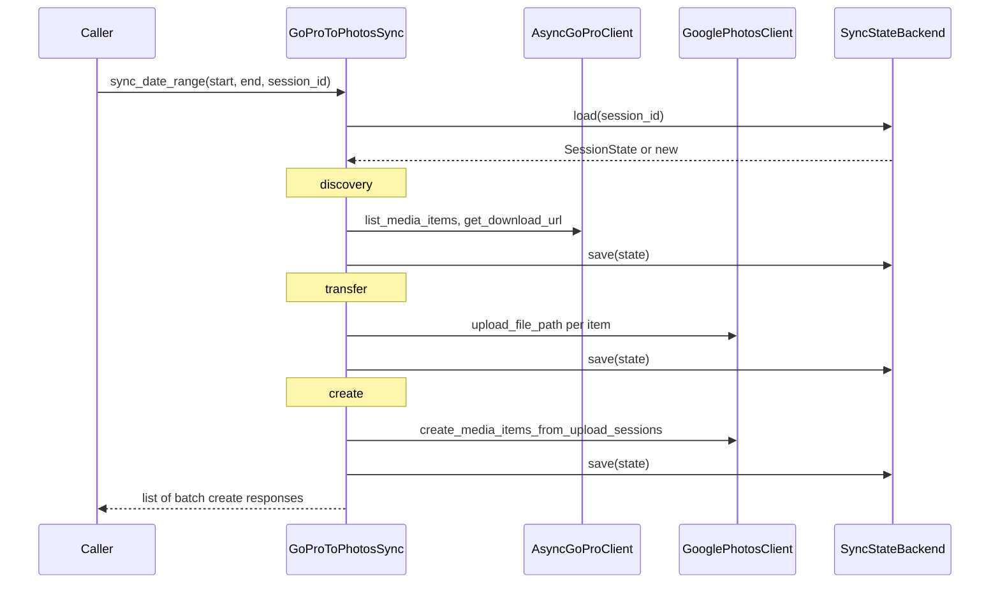

# q2google — architecture

## Overview

q2google moves assets from **GoPro cloud** (`gopro-api` / `AsyncGoProClient`) into **Google Photos Library** (resumable upload + `mediaItems:batchCreate`). Orchestration lives in `q2google.sync`; Google HTTP details live under `q2google.gphotos`; a thin facade is `q2google.photos`.

## Module map

| Path | Role |
|------|------|
| `q2google/config.py` | `Q2GoogleSettings` + `get_settings()` — env / `.env` defaults for CLI and library. |
| `q2google/cli.py` | Typer entrypoint; merges flags with `get_settings()`, wires clients and sync. |
| `q2google/sync.py` | `GoProToPhotosSync` — loads session, runs stages, logs results. |
| `q2google/stages/` | `DiscoveryStage`, `TransferStage`, `CreateStage` — one class per pipeline step. |
| `q2google/photos.py` | `GooglePhotosClient` + `GooglePhotoLibraryPort` — chunk upload and batched `batchCreate`. |
| `q2google/gphotos/` | Low-level Library v1 HTTP (`GooglePhotosAPI`), OAuth (`GooglePhotosOAuth`), Pydantic models. |
| `q2google/state/base.py` | `SessionState`, `ItemState`, `SyncStateBackend` protocol — persistence contract. |
| `q2google/state/local.py` | `JsonFileBackend` — one JSON file per session under a root directory. |

## Sync pipeline (`sync_date_range`)

``sync_date_range`` requires a configured ``state_backend`` and a ``session_id``. The run is split into **discovery**, **transfer**, and **create** stages. State is loaded/saved through ``SyncStateBackend.load`` / ``save`` on ``SessionState`` (JSON-serializable via ``to_dict`` / ``from_dict``).



## Extension: custom `SyncStateBackend`

Implement the protocol:

```python
from q2google import SessionState, SyncStateBackend

class CustomBackend:
    def load(self, session_id: str) -> SessionState | None:
        ...

    def save(self, state: SessionState) -> None:
        ...
```

`SessionState.to_dict()` / `from_dict()` produce a plain dict suitable for any document store. No changes to `GoProToPhotosSync` are required.

## Documentation conventions

Public modules, classes, and functions use a one-line summary, optional narrative, and structured
sections (`Args`, `Returns`, `Raises`, `Yields`, `Attributes`) where they add clarity.

## Tooling

- **UV** — `uv sync`, `uv run q2google …`, `uv run pytest`
- **Ruff** — lint + format (`task lint`, `task format`)
- **pytest** — `tests/` (`task test`)
