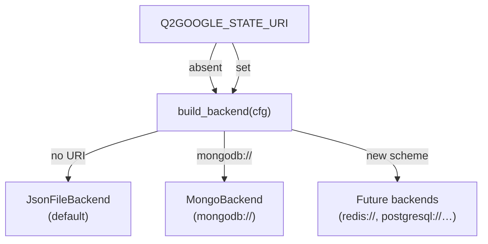

# State Backends

q2google persists every sync session through a `SyncStateBackend` — a small two-method
protocol that decouples the sync pipeline from any particular storage engine.

```python
class SyncStateBackend(Protocol):
    def load(self, session_id: str) -> SessionState | None: ...
    def save(self, state: SessionState) -> None: ...
```

The active backend is selected at startup by the `Q2GOOGLE_STATE_URI` environment variable.
When the variable is absent the filesystem backend is used by default, so existing setups
require no changes.



---

## Filesystem backend (default)

No extra packages required.  Each session is stored as a directory of JSON files under
`Q2GOOGLE_STATE_DIR` (default `.q2google_sessions`).

### Layout

```
.q2google_sessions/
  {session_id}/
    meta.json              # session metadata + stage statuses
    items/
      {file_name}.json     # one file per ItemState
    batches/
      {batch_index}.json   # one file per BatchState
```

Each file is written atomically via a temp file and `os.replace`, so a crash mid-save
never corrupts an existing checkpoint.

### Configuration

| Variable | Default | Description |
|----------|---------|-------------|
| `Q2GOOGLE_STATE_DIR` | `.q2google_sessions` | Root directory for session subdirectories. |
| `Q2GOOGLE_STATE_URI` | _(absent)_ | Leave unset to use this backend. |

### When to use

- Local CLI use or single-machine deployments.
- No external service dependency.
- Human-readable checkpoints (plain JSON files, easy to inspect or delete).

---

## MongoDB backend

Requires `pymongo`.  Each session is distributed across three collections that mirror
the filesystem layout, enabling per-collection queries and clear visibility into
what is running.

### Installation

=== "pip"

    ```bash
    pip install q2google[mongo]
    ```

=== "uv"

    ```bash
    uv add q2google[mongo]
    ```

### Configuration

Set `Q2GOOGLE_STATE_URI` to a MongoDB connection string.  The database name is taken
from the URI path component; it defaults to `q2google` when absent.

```dotenv
Q2GOOGLE_STATE_URI=mongodb://localhost:27017/q2google
```

| Variable | Example | Description |
|----------|---------|-------------|
| `Q2GOOGLE_STATE_URI` | `mongodb://host:27017/dbname` | Activates MongoBackend; `mongodb+srv://` is also supported. |

### Collection schema

**`sessions`** — one document per session

| Field | Type | Description |
|-------|------|-------------|
| `session_id` | string | Unique session key (index). |
| `schema_version` | int | Document format version. |
| `created_at` | string | ISO 8601 creation timestamp. |
| `updated_at` | string | ISO 8601 last-updated timestamp. |
| `start_date_iso` | string | Capture window start. |
| `end_date_iso` | string | Capture window end. |
| `batch_size` | int | Transfer batch size chosen at session creation. |
| `stages` | object | Map of stage key → status (`pending`/`running`/`completed`/`failed`). |

**`items`** — one document per `(session_id, file_name)`

| Field | Type | Description |
|-------|------|-------------|
| `session_id` | string | Parent session key (compound index with `file_name`). |
| `file_name` | string | GoPro logical filename. |
| `media_id` | string \| null | Remote media identifier once known. |
| `download_url` | string \| null | Resolved CDN URL after discovery. |
| `discovery_status` | string | `pending` / `running` / `completed` / `failed`. |
| `transfer_status` | string | `pending` / `running` / `completed` / `failed`. |
| `create_status` | string | `pending` / `running` / `completed` / `failed` / `skipped`. |
| `upload_token` | string \| null | Resumable upload token before library registration. |
| `errors` | object | Map of stage key → last `ErrorRecord`. |

**`batches`** — one document per `(session_id, batch_index)`

| Field | Type | Description |
|-------|------|-------------|
| `session_id` | string | Parent session key (compound index with `batch_index`). |
| `batch_index` | int | Zero-based index among create batches. |
| `file_names` | array | Filenames included in this batch. |
| `status` | string | `pending` / `running` / `completed` / `failed`. |
| `responses_json` | array \| null | Per-response JSON strings after success. |
| `error` | object \| null | Populated when the batch fails as a whole. |

### When to use

- Multi-machine or container deployments where a shared filesystem is unavailable.
- Observability — query individual collections to see item or batch progress without
  reading the full session document.
- When you need indexing, TTL expiry, or aggregation on session data.

---

## Custom backend

Implement `SyncStateBackend` to integrate any storage layer:

```python
from q2google import SessionState, SyncStateBackend
import json


class RedisBackend:
    def __init__(self, client):
        self._r = client

    def load(self, session_id: str) -> SessionState | None:
        raw = self._r.get(session_id)
        return SessionState.from_dict(json.loads(raw)) if raw else None

    def save(self, state: SessionState) -> None:
        self._r.set(state.session_id, json.dumps(state.to_dict()))
```

Pass it directly to `GoProToPhotosSync`:

```python
syncer = GoProToPhotosSync(gopro=gopro, photos=photos, state_backend=RedisBackend(redis_client))
```

`SessionState.to_dict()` / `from_dict()` produce a plain dict suitable for any
document or key-value store.  No changes to the sync pipeline are required.
