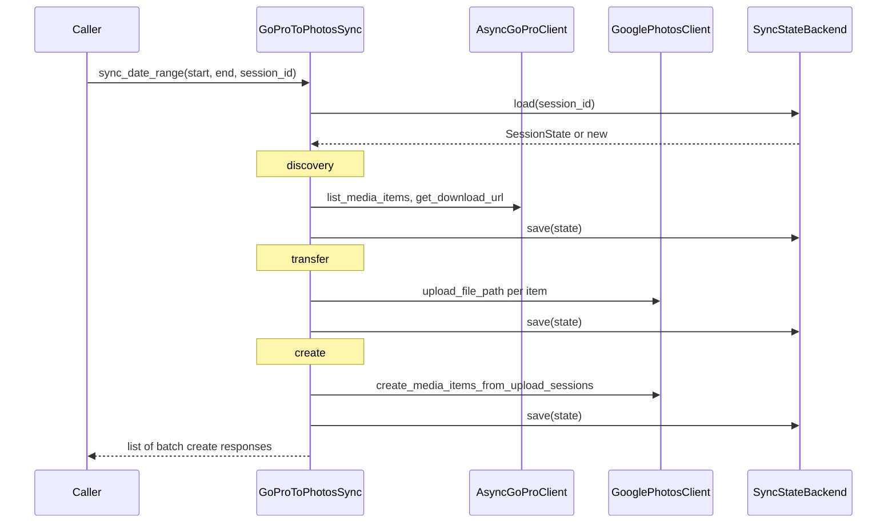

# q2google

**q2google** syncs media from [GoPro cloud](https://gopro.com) into [Google Photos](https://photos.google.com) for a capture date range, with resumable session state so interrupted runs continue from the last checkpoint.

---

## How it works

Every sync run is split into three sequential pipeline stages:

State is persisted through `SyncStateBackend` after each stage. Passing the same `session_id` on a subsequent run resumes from the last checkpoint — already-completed items are skipped.

---

## Quick links

- :material-rocket-launch: **[Getting Started](getting-started.md)**

    Install q2google and run your first sync in minutes.

- :material-console: **[CLI Reference](cli.md)**

    Full command-line interface documentation.

- :material-cog: **[Configuration](configuration.md)**

    Environment variables and settings reference.

- :material-sitemap: **[Architecture](ARCHITECTURE.md)**

    Module map and extension points.

- :material-api: **[API Reference](api/index.md)**

    Auto-generated documentation for all public symbols.

